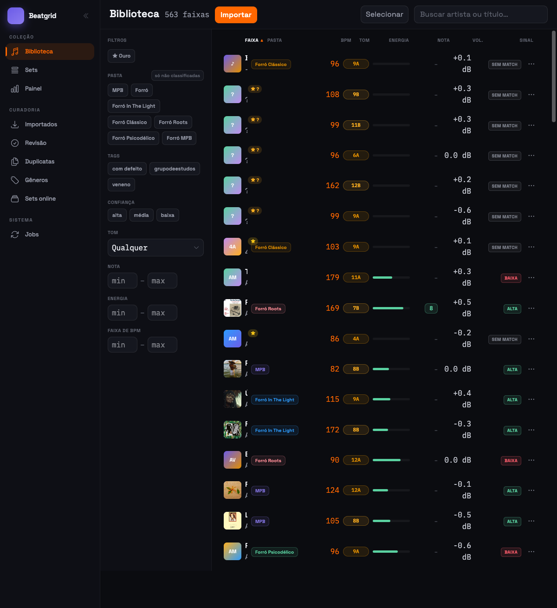
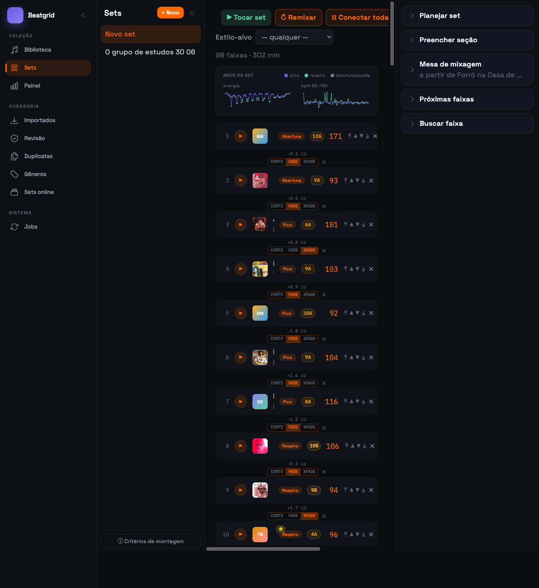
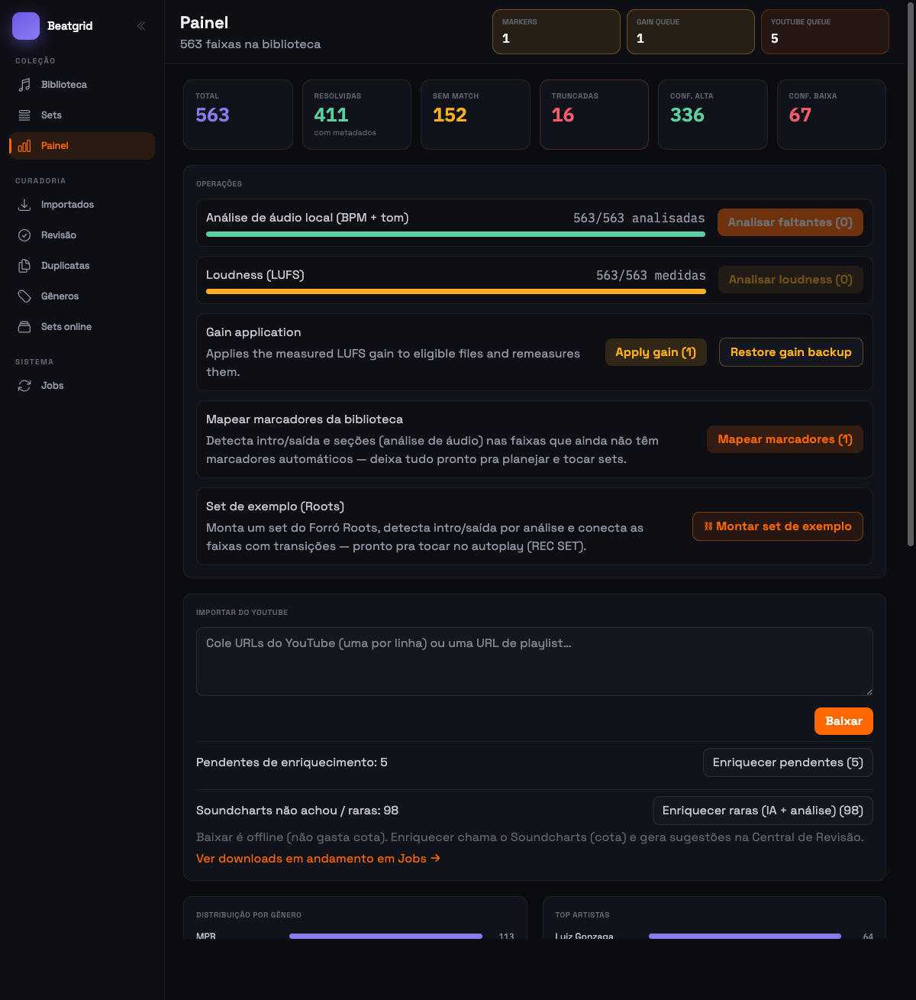

# Beatgrid

[](https://github.com/sallaumen/beatgrid/actions/workflows/ci.yml)
[](LICENSE)
[](https://elixir-lang.org)

**[English version](README.en.md)**

Gerenciador de biblioteca para DJ, feito em Elixir + Phoenix LiveView. Nasceu
para organizar uma coleção de forró e MPB: escaneia os arquivos de música do
disco, remove duplicatas, organiza em pastas por gênero, enriquece com
metadados (BPM, tom, energia), monta sets com arco de energia e transições, e
toca tudo num player com crossfade.

O **sistema de arquivos é a fonte da verdade**: mover uma faixa no app move o
arquivo no disco (com desfazer). O banco é só uma camada de conhecimento sobre
os arquivos — a música nunca vive neste repositório.

## Telas

**Biblioteca** — filtros por gênero, tom (Camelot), BPM, energia e nota; ações
em lote com desfazer:



**REC SET** — montador de sets com pontuação (estilo + harmonia + arco de
energia), planejador automático, transições entre faixas e exportação M3U:



**Painel** — visão geral da coleção e central de operações (análise de áudio,
loudness, marcadores, importação do YouTube, lacunas de repertório por IA):



## O que ele faz

- **Organiza de verdade**: dedup por conteúdo, pastas por gênero, quarentena
  reversível — nunca deleta um arquivo.
- **Metadados por todos os lados**: tags ID3 (ffprobe), API do Soundcharts
  (BPM/tom/energia), análise local com librosa (independente de API) e
  classificação de gênero por IA — tudo vira sugestão revisável antes de tocar
  no disco.
- **Sets dignos de DJ**: planejador com arco de energia (abertura → picos e
  respiros → queda), faixas raras nos auges, transições automáticas
  (corte/fade/crossfade) baseadas em marcadores de entrada/saída detectados por
  análise de áudio, e player com crossfade de dois decks.
- **Volume padronizado**: mede loudness (LUFS) e aplica ganho nos arquivos
  (mp3gain sem perda para MP3; ffmpeg para o resto), com desfazer.
- **Importação do YouTube**: cola uma URL ou playlist e as faixas caem na
  esteira normal de revisão.
- Toda mudança de disco passa por **propor → revisar → aplicar → desfazer**,
  registrada num log de operações.

## Como rodar

### Requisitos

Só os três primeiros são obrigatórios; o resto libera funcionalidades
individuais (o app roda sem eles, e a suíte de testes não precisa de nenhum —
tudo é mockado).

| Ferramenta | Para quê |
| --- | --- |
| Elixir 1.19 / OTP 27 | o app |
| Docker | PostgreSQL de dev e teste (porta 5434) |
| ffmpeg | leitura de metadados, tags, ganho |
| mp3gain *(opcional)* | ganho sem perda em MP3 |
| yt-dlp *(opcional)* | importação do YouTube |
| Python 3 + librosa *(opcional)* | BPM/tom/marcadores offline |
| claude CLI *(opcional)* | classificação de gênero e sugestões por IA |
| Chave do Soundcharts *(opcional)* | enriquecimento de metadados (`.env`) |

### macOS

```sh
brew install elixir ffmpeg           # + opcionais: mp3gain yt-dlp
pip install librosa                  # opcional: análise offline
```

### Linux (Debian/Ubuntu)

```sh
# Elixir/OTP: recomendado via asdf (https://asdf-vm.com) ou pacotes da distro
sudo apt install ffmpeg              # + opcionais: mp3gain yt-dlp
pip install librosa                  # opcional: análise offline
```

### Subir o app

```sh
docker compose up -d                 # Postgres (porta 5434)
cp .env.example .env                 # opcional: SOUNDCHARTS_* e LIBRARY_ROOT
mix setup                            # deps + banco + seeds + assets
mix phx.server                       # http://localhost:4000
```

Aponte `LIBRARY_ROOT` no `.env` para a sua pasta de músicas (padrão:
`~/Music/DJ`).

### Testes e qualidade

```sh
mix test     # suíte completa, rápida (ferramentas externas mockadas)
mix lint     # format + credo --strict + sobelow + dialyzer
```

## Arquitetura em uma nota

Contextos por domínio com módulos de query dedicados; toda integração externa
é um behaviour com adapter real + mock (Mox); jobs pesados rodam em background
(Oban) com progresso ao vivo via PubSub; erros são dados (`{:ok, _}` /
`{:error, _}`); TDD com gate estrito. Detalhes em `docs/playbook/` e
`AGENTS.md`.

## Licença

[MIT](LICENSE) — software livre: use, estude, modifique e distribua à vontade.

---

Um projeto pessoal, feito para a mala de um DJ de forró.
