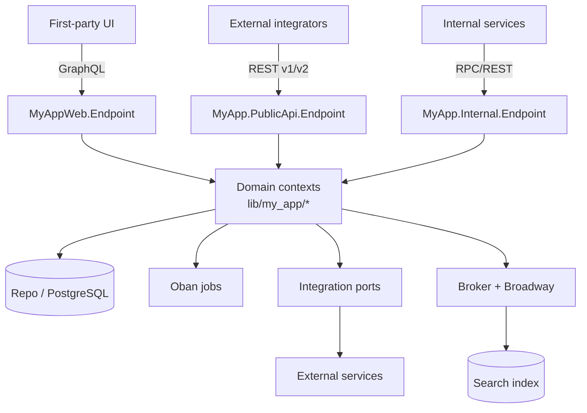

# 01 — Overview & Recommended Stack

A reference architecture for a substantial Elixir/Phoenix backend: an API for
clients, asynchronous workers, streaming/event pipelines, and integrations with
external services — all on one OTP application (a *modular monolith*), with clean
internal boundaries so it can be split later if needed.

## The recommended modern stack

| Concern | Recommended | Notes |
|---|---|---|
| Language / runtime | **Elixir 1.19+ / Erlang OTP 27+** | 1.20 introduces gradual typing; target the latest two minors |
| Web framework | **Phoenix 1.8+** | Endpoints, router, plugs, controllers, LiveView |
| Real-time UI | **LiveView 1.2+** | For first-party UIs; avoids a separate SPA where possible |
| Internal API (rich UI) | **Absinthe 1.8** (GraphQL) | Typed schema, Dataloader for N+1 |
| External API (integrators) | **Phoenix REST**, explicitly versioned | `/v1`, `/v2` URL-prefix versioning |
| Database | **PostgreSQL + Ecto 3.13+ / ecto_sql** | One repo module, wrapped (see [06](06-persistence-and-data.md)) |
| Background jobs | **Oban 2.23+** (Oban Pro for advanced features) | Postgres-backed, observable, transactional enqueue |
| Streaming / events | **Broadway** over a broker (RabbitMQ/SQS/Kafka) | Back-pressure, batching, fault tolerance |
| Scheduling | **Oban Cron** (and/or **Quantum**) | Postgres-backed recurrence vs. in-node scheduler |
| Search | **Elasticsearch/OpenSearch via Snap** | Event-driven indexing |
| Cache / locks / rate-limit | **Redis via Redix** | Or `:persistent_term`/ETS for in-node caches |
| Encryption at rest | **Cloak / cloak_ecto** | Custom Ecto type per encrypted field |
| Audit / versioning | **PaperTrail** and/or a custom append-only trail | See [03](03-domain-layer.md) |
| HTTP clients (outbound) | **Req** (REST), **Neuron** (GraphQL), a SOAP lib only if forced | Avoid HTTPoison/Tesla in new code |
| Errors / monitoring | **Sentry**, **PromEx + Telemetry**, **OpenTelemetry** | Structured logs via `logger_json` |
| Clustering | **libcluster** + **Highlander**/**Singleton** | Cluster-wide singletons for schedulers/pollers |
| Auth | An OIDC/OAuth provider + session/bearer tokens | Keep auth at the edge |

The headline rule: **prefer the current-generation library** and treat older ones
as legacy to migrate away from (Req over HTTPoison, Phoenix JSON views over
`Phoenix.View`, Dataloader over custom batchers). See
[11-libraries-and-tooling.md](11-libraries-and-tooling.md).

## Suggested code layout

```
lib/
├── my_app/              # DOMAIN — bounded contexts (the business logic core)
│   ├── accounts/        #   each context: context module + schemas + *_query modules + workers
│   ├── catalog/
│   ├── orders/
│   └── billing/
├── my_app_web/          # WEB — Phoenix endpoint, router, plugs; GraphQL or controllers
│   └── graphql/         #   Absinthe schema, types, resolvers, middleware (if GraphQL)
├── my_app/repo.ex       # the (wrapped) Ecto repo
├── ext/                 # small, generic extensions to the standard library
├── payments/            # an integration: behaviour (port) + adapter + error struct
├── sms/                 # another integration
└── …                    # one top-level namespace per external service

test/                    # mirrors lib/; test/support holds case templates + factories + mocks
config/                  # config.exs + dev/test/prod/runtime.exs
priv/repo/migrations/    # database migrations
```

Keep the **domain** (`lib/my_app`) free of web and transport concerns. Keep the
**web** layer (`lib/my_app_web`) free of business logic and queries. Keep each
**integration** in its own top-level namespace with a clear port.

## Runtime topology (OTP supervision)

Boot the system from an `Application` callback that assembles a supervision tree.
A clean pattern is to build the child list by piping through small helpers that
return a child spec *or* `:ignore`, so components are environment- and
feature-gated without branching noise.

```elixir
# lib/my_app/application.ex
defmodule MyApp.Application do
  use Application

  @impl true
  def start(_type, _args) do
    children =
      [MyApp.Telemetry]                 # start metrics first so no init events are missed
      |> add(MyApp.Repo)                 # DB before anything that uses it
      |> add(search_cluster())           # {MyApp.Search.Cluster, []} (or :ignore)
      |> add(redis())                    # {MyApp.Redis, []}            (or :ignore)
      |> add({Phoenix.PubSub, name: MyApp.PubSub})
      |> add(cluster())                  # libcluster topology          (or :ignore)
      |> add({Task.Supervisor, name: MyApp.TaskSupervisor})
      |> add(encryption_vault())         # MyApp.Vault (Cloak)
      |> add(oban())                     # {Oban, opts}                 (or :ignore)
      |> add(broker_pipelines())         # Broadway pipelines           (or :ignore)
      |> add(MyAppWeb.Endpoint)

    Supervisor.start_link(children, strategy: :one_for_one, name: MyApp.Supervisor)
  end

  defp add(children, :ignore), do: children
  defp add(children, child), do: children ++ [child]
end
```

Principles:

- **Order matters.** Start telemetry first (so initialization events are
  captured), the repo before anything that queries it, and the web endpoint last.
- **Feature-gate components** (`:ignore`) so the same release boots correctly as a
  web node, a worker node, or a one-off migration/release task.
- **Cluster-wide singletons** (a cron scheduler, a metrics poller, an
  exclusive consumer) should run on exactly one node — wrap them with
  **Highlander** or **Singleton**, or use Oban Pro's `global_limit: 1`.
- A trimmed "release tasks" tree (just the repo + minimal deps) is useful for
  running migrations and backfills without booting the whole app.

## Multiple endpoints

A large system often runs **more than one Phoenix endpoint** under the same OTP
app — e.g. a first-party API endpoint, a public/integrator endpoint, and an
internal service-to-service endpoint — each with its own plug pipeline, CORS
policy, and auth model. This isolates rate limits, body-size limits, and
auth strategies per surface while sharing the same domain underneath.



## Request lifecycle (the canonical flow)

Every inbound request follows the same shape, regardless of protocol:

```
request
  → endpoint plug pipeline (parsers, remote IP, session, CORS, Sentry context)
  → router pipeline (authenticate → build context → rate-limit)
  → edge handler (resolver / controller):
        authorize  →  call domain context function (passing an `origin`)
  → domain: changeset → Repo write (in a transaction if multi-step)
            → audit/version → broadcast (PubSub) → enqueue follow-up jobs
  → edge translates {:ok, _} / {:error, _} into the wire response
  → unmatched {:error, _} → a fallback handler maps it to a status + body
```

The web and worker layers are thin; **all business logic and all queries live in
the domain.** That boundary is the most important invariant in the system —
[02-architecture-and-layering.md](02-architecture-and-layering.md) makes it
concrete.
