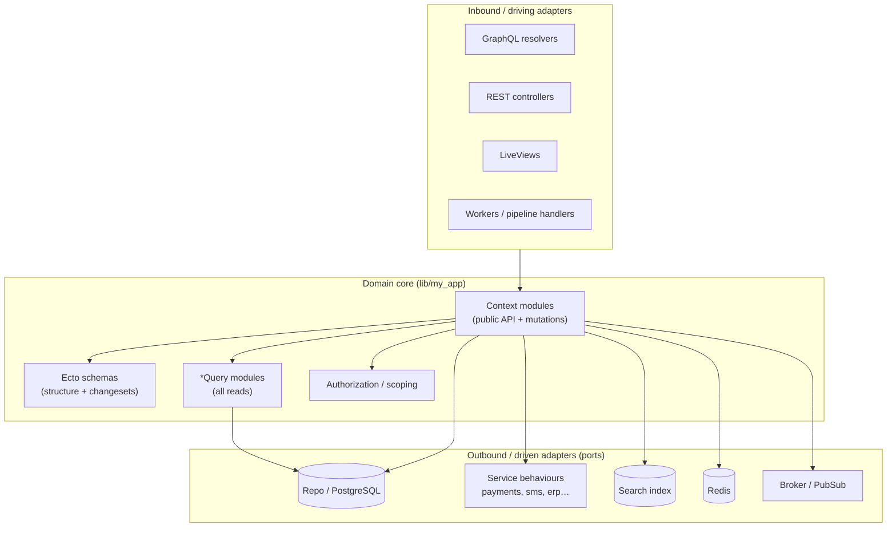

# 02 — Architecture & Layering

The shape of the system: the layers, the rules between them, and the recurring
structures. Internalize this and most of the codebase becomes predictable.

## Layered + hexagonal model

Organize the system into concentric layers with **dependencies pointing inward**.
Inbound adapters (the things that call you) and outbound adapters (the things you
call) both depend on the domain; the domain depends on neither.



### Layer responsibilities

**Inbound adapters** translate a protocol into a domain call and translate the
result back. They **authorize**, then **delegate**. No business logic, no
queries. (GraphQL: [04](04-graphql-layer.md); REST: [05](05-rest-api-layer.md).)

**Domain core** holds business rules, state transitions, validation, audit, and
orchestration. It assumes authorization already happened at the edge.

**Outbound adapters (ports)** are how the domain reaches the database (via query
modules + the repo), external services (via behaviours), search, cache, and the
message bus. The domain depends on *narrow interfaces*, not concrete clients.

**Cross-cutting** (stdlib extensions, origin/audit helpers, correlation IDs,
telemetry) is available to all layers.

## The dependency rules (the contract that keeps layers honest)

These are worth enforcing in code review (and in an AI's system prompt):

1. **Edges never build queries.** No `import Ecto.Query`, no `from(...)`, no
   `Repo.all/one` in resolvers or controllers. Query logic lives in `*Query`
   modules; the edge calls them. If the function doesn't exist yet, *add it to
   the query module* rather than reaching into Ecto at the edge.

2. **Authorize at the boundary, not in the context.** The resolver/controller
   calls the authorization policy before dispatching. Context functions trust
   that authorization happened — they don't re-check.

3. **Query modules return resolved results, not query structs.** A `*Query`
   function ends in `Repo.all/one/exists?`. Callers get data, not an `Ecto.Query`
   they must remember to run.

4. **No external calls inside an open transaction.** HTTP to a third party
   happens *before* opening or *after* committing a transaction — a network
   round-trip inside a transaction holds locks and turns timeouts into
   customer-facing errors.

5. **Every state-changing function carries an `origin`.** Who or what triggered
   the change is plumbed from the edge into the domain and recorded in the audit
   trail. Default to `:system` only for genuinely machine-triggered work.

6. **Render layers raise on missing data; they never query.** The caller
   preloads; the view renders. A `%Ecto.Association.NotLoaded{}` reaching a view
   is a bug and should crash loudly, not lazy-load.

## The triad — the atomic unit of the domain

Express every aggregate as three modules. This is *the* pattern to learn.

```
lib/my_app/orders.ex             # Context  — public API, mutations, side effects, audit
lib/my_app/orders/order.ex       # Schema   — schema "orders" + *_changeset/2 builders
lib/my_app/orders/order_query.ex # Query    — composable reads; owns Repo.all/one/exists?
```

The context delegates reads to the query module and keeps mutations itself:

```elixir
# lib/my_app/orders.ex
defmodule MyApp.Orders do
  alias MyApp.Orders.{Order, OrderQuery}

  # reads — delegated to the query module
  defdelegate get_order_by(opts), to: OrderQuery
  defdelegate fetch_order_by(opts), to: OrderQuery
  defdelegate list_orders_by(opts), to: OrderQuery

  # mutations — defined here (with origin, audit, transactions)
  def place_order(%Order{} = order, attrs, opts) do
    # ...
  end
end
```

This repeats for every aggregate (`Catalog.Product` + `Catalog.ProductQuery`,
`Accounts.User` + `Accounts.UserQuery`, …). The full anatomy of each leg is in
[03-domain-layer.md](03-domain-layer.md).

> **Why split reads into a `*Query` module?** Three payoffs: (1) query logic is
> discoverable and reusable from workers, controllers, and other contexts — not
> trapped in a resolver; (2) it's unit-testable in isolation; (3) it keeps the
> context module focused on behavior, not `from/2` plumbing.

## Bounded contexts (DDD)

Model the domain as a flat set of **bounded contexts** — one top-level module per
context, plus a same-named directory for its schemas, query modules, workers,
errors, and helpers.

- **Be specific with names.** Avoid generic catch-alls (`Helpers`, `Util`,
  `Data`, `Manager`). A vague top-level module becomes a junk drawer.
- **Put cross-cutting modules under the context they belong to**, not at the top
  level. A "migrate account" routine belongs in `Accounts`, not at the root.
- **Don't introduce a third name for an existing concept.** If the codebase
  already has two terms for a thing, pick one — don't add a synonym.
- **Contexts may call other contexts**, but through their public API, not by
  reaching into another context's schemas/queries directly. Keep the coupling at
  the front door.

## The hexagonal edge (ports & adapters)

External services are the cleanest place to apply ports & adapters. Each
integration is:

- a **behaviour** (`@callback`) — the port contract, returning tagged tuples of
  typed structs;
- a **facade** that resolves the adapter at compile time and `defdelegate`s every
  callback;
- a **real adapter** implementing the behaviour;
- a **config selector** choosing the implementation;
- a **mock** built for the same behaviour, wired in test config, so tests run
  offline.

```elixir
# lib/payments.ex — the port
defmodule Payments do
  @behaviour Payments.Behaviour
  @adapter Application.compile_env!(:my_app, [Payments, :adapter])  # Payments.HTTP in prod, PaymentsMock in test

  @impl true
  defdelegate authorize_charge(params), to: @adapter
  @impl true
  defdelegate capture_charge(charge_id), to: @adapter
end
```

Rich domains add a **second port**: a domain-level gateway that speaks the
domain's own vocabulary (`MyApp.Billing.Gateway`) and translates to the
lower-level SDK port (`Payments`). Full treatment in
[08-integrations.md](08-integrations.md).

## Where each kind of change goes

| You are… | Touch these, in this order |
|---|---|
| Adding a field that reads data | query module (add the read fn) → resolver/controller (call it) → type/view (expose it) → test |
| Adding a domain mutation | schema changeset → context function (origin, audit, transaction) → edge → test (first) |
| Adding a REST endpoint | input module (embedded schema) → controller action → JSON view → router → API doc → test |
| Integrating an external service | behaviour (port) → adapter → config selector → mock → context that consumes it |
| Adding async work | worker (args = IDs, `enqueue/1`) → enqueue from the context → worker test |
| Adding a column / index | migration (UUID PK, `:utc_datetime`, idempotent + concurrent index) → schema field (`Ecto.Enum`) → changeset constraint helper |

The remaining per-layer docs expand each row with code.
